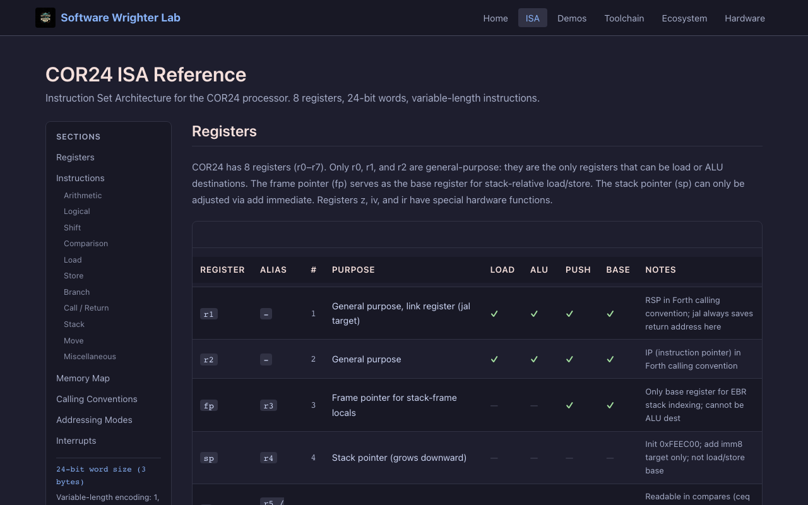

# Software Wrighter Lab -- COR24 Tools & Demos

> 24-bit RISC for FPGA embedded systems -- documentation, live browser demos, and ecosystem hub.

**Live demo:** [sw-embed.github.io/web-sw-cor24-demos](https://sw-embed.github.io/web-sw-cor24-demos/)

## Overview

This is the landing page and documentation hub for the entire [COR24](https://makerlisp.com/cor24-soft-cpu-for-fpga) ecosystem, developed by [Software Wrighter Lab](https://software-wrighter-lab.github.io/). COR24 is a 24-bit RISC soft CPU designed by [MakerLisp](https://makerlisp.com) for FPGA-based embedded systems, running at 101 MHz on Lattice MachXO2 FPGAs.

The site provides:

- **Directory of all live web demos** with links and descriptions
- **Comprehensive COR24 ISA documentation** -- registers, instruction set, encoding formats
- **Hardware reference** with links to MakerLisp.com specifications and dev board docs
- **Documentation for every tool** in the sw-embed ecosystem (cross-compilers, assemblers, interpreters, VM, monitor)

Built with [Rust](https://www.rust-lang.org/), [Yew 0.21](https://yew.rs/), and [WebAssembly](https://webassembly.org/) via [Trunk](https://trunkrs.dev/). Deployed to GitHub Pages.

## Screenshots

### Home

The home page shows the COR24 software stack with categorized demo cards and an architecture overview.


### ISA Reference

Complete instruction set reference with register tables, encoding format cards, and per-category instruction listings.



### Hardware

COR24 hardware specifications and links to MakerLisp.com for the soft CPU, dev board, and technical resources.


### Mobile

Responsive layout for mobile devices.


## Pages & Navigation

| Tab | Description |
|---|---|
| **Home** | Hero section, categorized demo grid (7 categories, 13 demos), architecture overview |
| **ISA** | Full ISA reference: 8 registers, 34 instructions across 11 categories, encoding formats |
| **Demos** | Directory of all live browser demos (coming soon) |
| **Toolchain** | Cross-compilers, assemblers, and tool documentation (coming soon) |
| **Ecosystem** | Ecosystem map and inter-project relationships (coming soon) |
| **Hardware** | COR24 specs, MakerLisp.com links (soft CPU, dev board, technical info, news, contact) |

## COR24 Architecture

| Feature | Specification |
|---|---|
| Word size | 24 bits (3 bytes) |
| Address space | 16 MB (24-bit addresses) |
| Registers | 8 x 24-bit (3 GP, 5 special) |
| Instruction sizes | 1, 2, or 4 bytes (variable-length encoding) |
| Clock speed | 101 MHz |
| FPGA | Lattice MachXO2 (LFE5U-25F) |
| SRAM | 1 MB on-board |
| EBR | 3 KB embedded block RAM (stack) |
| I/O | UART, GPIO (SPI/I2C), button, LED |

## Ecosystem

All COR24 repos live under `sw-embed` on GitHub. This landing page documents all of them.

### Foundation
- [sw-cor24-emulator](https://github.com/sw-embed/sw-cor24-emulator) -- COR24 assembler and emulator (Rust)
- [sw-cor24-x-assembler](https://github.com/sw-embed/sw-cor24-x-assembler) -- Cross-assembler library (Rust)
- [sw-cor24-assembler](https://github.com/sw-embed/sw-cor24-assembler) -- Native assembler (C, runs on COR24)
- [sw-cor24-project](https://github.com/sw-embed/sw-cor24-project) -- Ecosystem hub/portal (docs only)

### Cross-compilers
- [sw-cor24-x-tinyc](https://github.com/sw-embed/sw-cor24-x-tinyc) -- Tiny C cross-compiler (Rust)
- [sw-cor24-rust](https://github.com/sw-embed/sw-cor24-rust) -- Rust-to-COR24 pipeline

### P-code System
- [sw-cor24-pcode](https://github.com/sw-embed/sw-cor24-pcode) -- P-code VM (COR24 asm), assembler (Rust), linker (Rust)
- [sw-cor24-x-pc-aotc](https://github.com/sw-embed/sw-cor24-x-pc-aotc) -- P-code AOT compiler (Rust)
- [sw-cor24-pascal](https://github.com/sw-embed/sw-cor24-pascal) -- Pascal compiler (C) + runtime

### Languages
- [sw-cor24-macrolisp](https://github.com/sw-embed/sw-cor24-macrolisp) -- Tiny Macro Lisp (C)
- [sw-cor24-forth](https://github.com/sw-embed/sw-cor24-forth) -- Forth (COR24 assembly)
- [sw-cor24-apl](https://github.com/sw-embed/sw-cor24-apl) -- APL interpreter (C)
- [sw-cor24-basic](https://github.com/sw-embed/sw-cor24-basic) -- BASIC interpreter (C)
- [sw-cor24-fortran](https://github.com/sw-embed/sw-cor24-fortran) -- Fortran compiler (C)
- [sw-cor24-plsw](https://github.com/sw-embed/sw-cor24-plsw) -- PL/SW compiler (C, PL/I-inspired)
- [sw-cor24-script](https://github.com/sw-embed/sw-cor24-script) -- SWS scripting language (C, Tcl-like)

### System Software
- [sw-cor24-monitor](https://github.com/sw-embed/sw-cor24-monitor) -- Resident monitor/service processor (COR24 asm + C)

### Live Web Demos
- [web-sw-cor24-assembler](https://sw-embed.github.io/web-sw-cor24-assembler/) -- COR24 assembly IDE
- [web-sw-cor24-pcode](https://sw-embed.github.io/web-sw-cor24-pcode/) -- P-code VM debugger
- [web-sw-cor24-tinyc](https://sw-embed.github.io/web-sw-cor24-tinyc/) -- Tiny C compiler
- [web-sw-cor24-macrolisp](https://sw-embed.github.io/web-sw-cor24-macrolisp/) -- Lisp REPL
- [web-sw-cor24-pascal](https://sw-embed.github.io/web-sw-cor24-pascal/) -- Pascal demos
- [web-sw-cor24-apl](https://sw-embed.github.io/web-sw-cor24-apl/) -- APL environment
- [web-sw-cor24-forth](https://sw-embed.github.io/web-sw-cor24-forth/) -- Forth debugger
- [web-sw-cor24-plsw](https://sw-embed.github.io/web-sw-cor24-plsw/) -- PL/SW development environment
- **web-sw-cor24-demos** -- THIS REPO (landing page)

## Tech Stack

- **Rust** (edition 2024) with **Yew 0.21** for the UI
- **WebAssembly** via **Trunk** for browser deployment
- **wasm-bindgen** + **web-sys** for browser APIs
- **Catppuccin Mocha** dark theme
- **Playwright** for automated UI smoke testing
- GitHub Actions for CI/CD to GitHub Pages

## Development

```bash
./scripts/serve.sh             # Dev server with hot reload (port 1300)
./scripts/build.sh             # Release build to dist/
./scripts/build-pages.sh       # Release build to pages/ for GitHub Pages
./scripts/ui-test.sh           # Playwright smoke tests against dist/
cargo clippy --all-targets --all-features -- -D warnings
cargo fmt --all
cargo test
cargo check --target wasm32-unknown-unknown
```

## Copyright & License

(c) 2026 Michael A Wright. Released under the [MIT License](LICENSE).

COR24 architecture and hardware by [MakerLisp](https://makerlisp.com).
